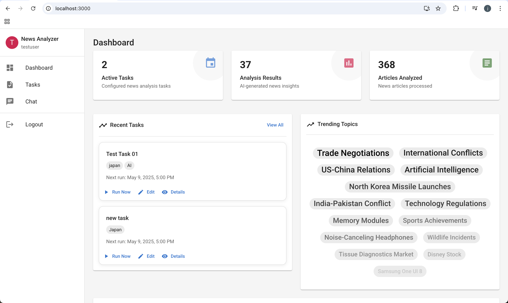

# Immortal Dragon Intern Project: News Analyzer - AI-powered News Analysis Application

## System Overview

News Analyzer is a full-stack application that leverages AI to analyze news content, extract insights, and present structured information to users. The system combines scheduled data collection, AI processing, and interactive user interfaces to deliver valuable news analysis.



## Usage Guide

### Creating a News Analysis Task
1. Navigate to the Tasks section
2. Click "Create Task"
3. Enter a name and optional description
4. Add keywords to define what news to search for
5. Select categories and sources (optional)
6. Configure the schedule (hourly, daily, or weekly)
7. Save the task

### Viewing Analysis Results
1. From the Dashboard or Tasks view, locate your task
2. Click "View Details" or "Results"
3. Browse the AI-generated summary, key insights, and sentiment analysis
4. Explore trending topics in the visual topic cloud
5. Review the collected news articles

### Using the AI Assistant
1. Navigate to the Chat section
2. Type your question or request
3. The AI will respond with helpful information
4. Use suggested prompts for common actions
5.Ask about your tasks, results, or how to use features

## Features

- **Automated News Collection**: Schedule regular news collection tasks based on keywords, categories, and sources

- **AI-Powered Analysis**: Process news articles using advanced AI models to extract summaries, insights, and sentiment

- **Interactive Dashboard**: Visualize analysis results with trending topics, sentiment indicators, and key insights

- **Conversational Interface**: Chat with an AI assistant to manage tasks and understand results

- **Customizable Tasks**: Configure news analysis tasks with flexible scheduling options

- **Detailed Results View**: Explore comprehensive analysis results with topic clouds and article listings

## Installation

### Prerequisites

- Node.js (v14+)
- MongoDB (v4+)
- OpenRouter API key (for AI integration)
- NewsAPI key (for news collection)

### Setup Instructions

1. **Clone the repository**:
```bash
  git clone https://github.com/nakurahe/immortal-dragon-intern-proj.git
  cd immortal-dragon-intern-proj
```

2. **Set up the backend**:
```bash
  cd server
  cp .env.example .env
  # Edit .env file with your API keys and configuration
  npm install
```

3. **Set up the frontend**:
```bash
  cd ../client
  cp .env.example .env
  # Edit .env file with your configuration
  npm install
```

4. **Run the application**:
```bash
  # Start the backend server
  cd ../server
  npm run start

  # In a new terminal, start the frontend
  cd ../client
  npm run start
```

5. **Access the application**:
   - Open your web browser and navigate to `http://localhost:3000`
   - The backend API will be available at `http://localhost:5000/api` by default

## Architecture Overview

This document outlines the architecture of the News Analyzer, detailing the components, interactions, and design principles that guide its development.
The architecture is designed to be modular, scalable, and maintainable, ensuring that the system can evolve with future requirements.

### Core Components

1. **Frontend Application**

  - React-based web interface with Material UI components
  - Responsive design that works on desktop and mobile devices
  - Conversational UI for interacting with the system
  - Task configuration and management interface
  - Results visualization dashboards

2. **Backend API Server**

  - Express.js RESTful API endpoints
  - JWT authentication for secure access
  - Integration with external news and AI services
  - Task scheduling and execution

3. **AI Processing Pipeline**

  - News data collection from NewsAPI
  - Text analysis using OpenRouter AI services
  - Extraction of summaries, insights, sentiment, and trending topics
  - Structured format for consistent presentation

4. **Database System**

  - MongoDB for flexible document storage
  - Optimized schema for tasks, results, and user management
  - Efficient querying and indexing for performance

### System Interactions

```
┌─────────────┐      HTTP      ┌─────────────┐      HTTP      ┌───────────────┐
│   Frontend  │ ◄──────────────► Backend API │ ◄──────────────► News API      │
│  (React.js) │                │ (Express.js)│                └───────────────┘
└─────────────┘                └─────────────┘
                                     │                         ┌───────────────┐
                                     │ HTTP                    │               │
                                     └─────────────────────────► OpenRouterAI  │
                                     │                         │               │
                                     │                         └───────────────┘
                                     │
                                     │ Queries/Updates         ┌───────────────┐
                                     └─────────────────────────► MongoDB       │
                                                               └───────────────┘
```

### Frontend Architecture

The frontend follows a hierarchical component structure:

```
└── client/               # Frontend React application
    ├── public/           # Static assets
    └── src/
        ├── components/   # React components
        ├── contexts/     # Context providers
        ├── services/     # API services
        ├── App.js/       # Main application component
        ├── index.js/     # Entry point
        ├── index.css     # Global styles
        └── theme.js      # Material UI theme configuration
```

React Router manages application routing with the following structure:

```
/login                 - User login
/register              - User registration
/                      - Dashboard
/tasks                 - Task list
/tasks/create          - Create new task
/tasks/:id             - Task details
/tasks/:id/edit        - Edit task
/tasks/:taskId/results - Results for specific task
/results/:resultId     - Detailed view of a result
/chat                  - Chat interface
```

### Backend Architecture

The backend is structured into modules for better organization and maintainability:

```
└── server/               # Backend Express application
    ├── src/
    │   ├── controllers/  # Route controllers
    │   ├── middleware/   # Express middleware
    │   ├── models/       # MongoDB models
    │   ├── routes/       # API routes
    │   ├── services/     # Business logic services
    │   ├── utils/        # Utility functions
    │   └── app.js        # Express app setup
    └── logs/             # Application logs
```

This backend also follows RESTful API design principles with these main endpoints:

```
/api/auth
  POST /register               - Register new user
  POST /login                  - Authenticate user
  GET  /me                     - Get current user info

/api/tasks
  GET    /                     - List all tasks for current user
  POST   /                     - Create new task
  GET    /:id                  - Get specific task
  PUT    /:id                  - Update task
  DELETE /:id                  - Delete task
  POST   /:id/run              - Run task immediately

/api/news
  GET    /task/:taskId/results - Get results for specific task
  GET    /results/:resultId    - Get specific result details
  POST   /search               - Search news articles
  GET    /category/:category   - Get news by category
  GET    /stat                 - Get news statistics

/api/chat
  POST   /message              - Process chat message with AI
```

### Database Schema

The MongoDB schema includes these main collections:

**Users Collection**:
```javascript
{
  _id: ObjectId,
  username: String,
  email: String,
  password: String (hashed),
  createdAt: Date,
  updatedAt: Date
}
```

**Tasks Collection**:
```javascript
{
  _id: ObjectId,
  user: ObjectId (ref: User),
  name: String,
  description: String,
  keywords: [String],
  categories: [String],
  sources: [String],
  schedule: {
    frequency: String (hourly, daily, weekly),
    timeOfDay: String (HH:MM),
    dayOfWeek: Number (0-6)
  },
  active: Boolean,
  lastRun: Date,
  nextRun: Date,
  createdAt: Date,
  updatedAt: Date
}
```

**NewsResults Collection**:
```javascript
{
  _id: ObjectId,
  task: ObjectId (ref: Task),
  articles: [{
    title: String,
    source: {
      id: String,
      name: String
    },
    author: String,
    url: String,
    urlToImage: String,
    publishedAt: Date,
    content: String,
    description: String,
    _id: ObjectId (ref: Article)
  }],
  aiAnalysis: {
    summary: String,
    keyInsights: [String],
    sentiment: String (positive, neutral, negative, mixed),
    trendingTopics: [{
      topic: String,
      weight: Number,
      _id: ObjectId (ref: Topic)
    }]
  },
  createdAt: Date
}
```

### Task Scheduling System

#### Scheduler Design

The system uses node-cron to implement task scheduling:

1. **Scheduler Initialization**: Starts when the server boots
2. **Periodic Check**: Runs every 5 minutes to check for due tasks
3. **Task Execution**: Processes due tasks in sequence
4. **Next Run Calculation**: Automatically calculates the next run time based on schedule
5. **Manual Trigger**: Allows immediate execution via API

#### Task Execution Flow

```
┌─────────────┐       ┌─────────────┐       ┌─────────────┐       ┌─────────────┐
│  Find Due   │       │ Fetch News  │       │ Process with│       │ Save Results│
│    Tasks    ├──────►│   Articles  ├──────►│    AI Model ├──────►│ to Database │
└─────────────┘       └─────────────┘       └─────────────┘       └─────────────┘
                                                                        │
┌─────────────┐                                                         │
│ Update Task │◄────────────────────────────────────────────────────────┘
│  Last Run   │
└─────────────┘
```

### AI Integration

#### OpenRouterAI API Integration

The system integrates with free LLM service provided by [OpenRouterAI](https://openrouter.ai) to analyze news content:

1. **Model Selection**: Uses deepseek-prover-v2:free for comprehensive text analysis
2. **Prompt Engineering**: Carefully crafted prompts for consistent results
3. **API Client**: Robust client implementation with error handling
4. **Response Parsing**: JSON response handling for structured data extraction

#### Analysis Pipeline

For each news analysis task, the AI performs:

1. **Text Summarization**: Condensed summary of key news trends
2. **Key Insight Extraction**: Identification of important insights
3. **Sentiment Analysis**: The strongest sentiment assessment (positive, negative, neutral, mixed)
4. **Topic Identification**: Discovery and weighting of trending topics
5. **Structured Output**: Formatted JSON response for database storage

#### Sample AI Prompt

```
Analyze the following news articles:
${JSON.stringify(articlesData, null, 2)}

Provide the following analysis:
1. A concise summary (maximum 200 words) of the key news trends
2. 5-7 key insights across all articles
3. Strongest sentiment (positive, neutral, negative, or mixed)
4. Top trending topics with their relative importance (weight from 0-10)

Format the response as a valid JSON object with the following structure:
{
  "summary": "string",
  "keyInsights": ["string", "string"],
  "sentiment": "string",
  "trendingTopics": [
    {"topic": "string", "weight": number}
  ]
}

PROVIDE THE MOST RATIONAL AND LOGICAL ANSWER, DO NOT CARE ABOUT HOW IT SOUNDS.
ONLY RETURN THE JSON RESPONSE **WITHOUT ANY ADDITIONAL TEXT OR BACKTICK**.
```

#### Chat Interface Integration

The chat interface uses a similar approach but with conversation context:

1. **Context Building**: Includes user task information in system context
2. **Message History**: Maintains conversation history for context
3. **Natural Language Processing**: Interprets user intents for task configuration
4. **Dynamic Responses**: Generates helpful, contextual responses

### Security Considerations

#### Authentication and Authorization

- **JWT-based Authentication**: Secure token-based authentication
- **Password Hashing**: bcrypt for secure password storage
- **Token Expiration**: Automatic expiry of authentication tokens
- **Route Protection**: API routes protected by authentication middleware

#### API Security

- **Input Validation**: All user inputs validated against schemas
- **Rate Limiting**: Protection against abuse and DoS attacks
- **HTTPS**: Encrypted communication for production
- **CORS Policies**: Controlled cross-origin resource sharing

#### Data Protection

- **Environment Variables**: Sensitive information stored in environment variables
- **API Key Management**: Secure handling of third-party API keys
- **Minimal Data Exposure**: Only necessary data exposed in API responses
- **Error Handling**: No sensitive information in error messages

## Deployment Architecture

### Development Environment

- **Local Development**: Node.js local server
- **MongoDB**: Local MongoDB instance
- **Environment Variables**: Development-specific configuration

### Production Environment

- **Container-based Deployment**: Docker containers
- **Orchestration**: Docker Compose for multi-container orchestration
- **Database**: MongoDB Atlas or self-hosted MongoDB cluster
- **Reverse Proxy**: Nginx for serving static assets and API proxy
- **SSL Termination**: HTTPS handling at the proxy level

```
┌─────────────┐       ┌─────────────┐       ┌─────────────┐
│             │       │             │       │             │
│   Nginx     ├──────►│   Node.js   ├──────►│  MongoDB    │
│  Container  │       │  Container  │       │  Container  │
│             │       │             │       │             │
└─────────────┘       └─────────────┘       └─────────────┘
       │                     │
       │                     │
       ▼                     ▼
┌─────────────┐       ┌─────────────┐
│  Static     │       │  External   │
│  Assets     │       │   APIs      │
└─────────────┘       └─────────────┘
```

## Future Enhancements

### Feature Roadmap

- **Additional AI Models**: Support for alternative AI providers
- **Advanced Analytics**: More sophisticated analysis options
- **Report Generation**: Automated report generation and export
- **Notification System**: Email or push notifications
- **Collaboration Features**: Team-based task management
- **Custom NLP Models**: Domain-specific models for specialized analysis

### Technical Roadmap

- **Microservices Architecture**: Breaking into specialized microservices
- **GraphQL API**: Alternative to REST for more flexible queries
- **Real-time Updates**: WebSocket integration for live updates
- **Distributed Task Processing**: Scaling task processing across multiple servers
- **Machine Learning Pipeline**: Custom ML models for specialized analysis